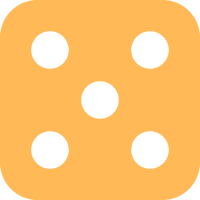

 

  

  <h3 align="center">Random Team Generator</h3>

  

    Random team generator with the ability to fix some member in the same team
     
    <a href="https://random-team-generator-xd.vercel.app"><strong></strong></a>
     
     
    <a href="https://random-team-generator-xd.vercel.app">View Demo</a>
    ·
    <a href="https://github.com/kuurena/Random-Team-Generator/issues">Report Bug</a>
    ·
    <a href="https://github.com/kuurena/Random-Team-Generator/issues">Request Feature</a>
  

<!-- ABOUT THE PROJECT -->
## About The Project

[![Product Name Screen Shot][product-screenshot]](https://random-team-generator-xd.vercel.app)

I created this handy tool out of a personal need. Often, I found myself needing to generate random teams, but I couldn't find one that allowed for certain members to always be grouped together. 
So, I made this one. I've also included two visual themes - '8-bit' and '3D' to make it more interesting.
The logic for this is in component/logic.js feel free to check them out.

### Built With

This project made with react and vite as well as tailwind css for styling.

* [![React][React.js]][React-url]
* [![Vite][Vite.js]][Vite-url]
* [![TailwindCSS][TailwindCSS.js]][TailwindCSS-url]

(<a href="#readme-top">back to top</a>)

<!-- MARKDOWN LINKS & IMAGES -->
[product-screenshot]: public/screenshot.png
[TailwindCSS.js]: https://img.shields.io/badge/tailwindcss-%2338B2AC.svg?style=for-the-badge&logo=tailwind-css&logoColor=white
[TailwindCSS-url]: https://nextjs.org/
[React.js]: https://img.shields.io/badge/React-20232A?style=for-the-badge&logo=react&logoColor=61DAFB
[React-url]: https://reactjs.org/
[Vite.js]: https://img.shields.io/badge/vite-%23646CFF.svg?style=for-the-badge&logo=vite&logoColor=white
[Vite-url]: https://vitejs.dev/

